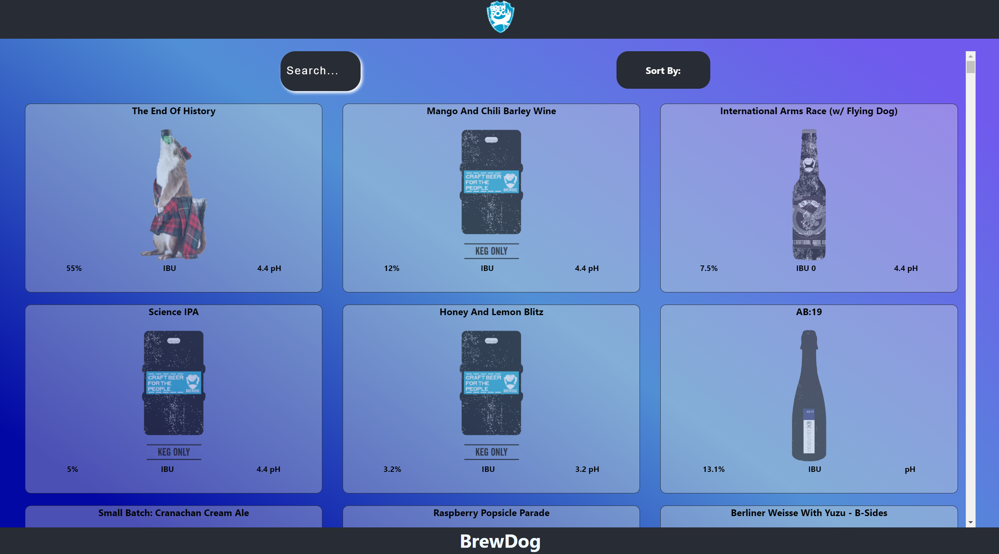
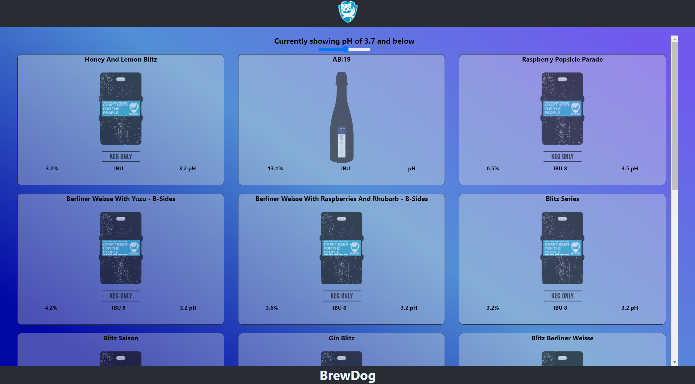

  

<h3 align="center">punk-api</h3>

 This is my Punk API react project where you're able to see a collection of beers from BrewDog, sort, filter and search for a specific beer or one that meets your preference regarding ABV percentage, pH amounts and date brewed criteria. 
      

## 📝 Table of Contents

- [Getting Started](#getting_started)
- [Running the tests](#tests)
- [Deployment](#deployment)
- [Usage](#usage)
- [Future Scope](#future_scope)
- [Available Scripts](#available_scripts)
- [Authors](#authors)

## 🏁 Getting Started 

These instructions will get you a copy of the project up and running on your local machine for development and testing purposes. See [deployment](#deployment) for notes on how to deploy the project on a live system.

Clone the repository down using bash or another terminal. Once cloned down to your local machine cd into the project folder and run the command npm install to install all the dependencies needed to work the project. 

## 🔧 Running the tests 

To run a test go to the specified components folder and open the test file. Open a new terminal and in that terminal run the command npm run test to run all the tests written in for that component.

## 🚀 Deployment 

Add additional notes about how to deploy this on a live system.

After all project dependencies have been installed you can run npm run start to get a live site version of the punk API project running.

## 🎈 Usage 

The webpage was made using React and SCSS.
You can access the webpage <a href="https://connz17.github.io/punk-api/">HERE.</a>

### Landing Page 
Once on the home page you can look through the whole collation of beers from brew dog with cards for each beer containing some basic information.

 
Hovering over a beer will highlight that selection.

### Search box
There is search functionality utilized by typing in the search bar to filter through specific beer names. The beers displayed on page will reduce in number to only those that meet the criteria typed.

### Sort and/or filter options & pages
There is a menu that you can access to specifically order the results based on set criteria.

#### AVB percentage
This page orders the beers shown based on their ABV percentage. You can change the minimum percentage by using the slider.

#### IBU
This page orders the beers shown based on their IBU rating. You can change the IBU by using the slider.

#### pH
This page orders the beers shown based on their pH. You can change the minimum pH by using the slider.

#### Classic range
This page shows all the beers brewed before 2010

### Single beer information page
This page shows more information about a selected beer including a description and tips.

### `Features of note`

## 🚀 Future Scope 

The road-map for future features, fixes and developments are as follows:
 <ul>
    <li>Add user feedback for no beers shown</li>
    <li>Add a dropdown card list of beers coming from the search box onFocus that would contain all available beer selections and narrow that list down based on user input</li>
    <li>Add the ability for filters to all work together</li>
  </ul>

## Available Scripts 

In the project directory, you can run: 

### `npm start`
Runs the app in the development mode.\
Open [http://localhost:3000](http://localhost:3000) to view it in your browser.

The page will reload when you make changes.\
You may also see any lint errors in the console.

### `npm test`
Launches the test runner in the interactive watch mode.\
See the section about [running tests](https://facebook.github.io/create-react-app/docs/running-tests) for more information.

### `npm run build`

Builds the app for production to the `build` folder.\
It correctly bundles React in production mode and optimizes the build for the best performance.

The build is minified and the filenames include the hashes.\
Your app is ready to be deployed!

See the section about [deployment](https://facebook.github.io/create-react-app/docs/deployment) for more information.

### `npm run eject`

**Note: this is a one-way operation. Once you `eject`, you can't go back!**

If you aren't satisfied with the build tool and configuration choices, you can `eject` at any time. This command will remove the single build dependency from your project.

Instead, it will copy all the configuration files and the transitive dependencies (webpack, Babel, ESLint, etc) right into your project so you have full control over them. All of the commands except `eject` will still work, but they will point to the copied scripts so you can tweak them. At this point you're on your own.

You don't have to ever use `eject`. The curated feature set is suitable for small and middle deployments, and you shouldn't feel obligated to use this feature. However we understand that this tool wouldn't be useful if you couldn't customize it when you are ready for it.

## ✍️ Authors 

- [@Connz17](https://github.com/Connz17) 

